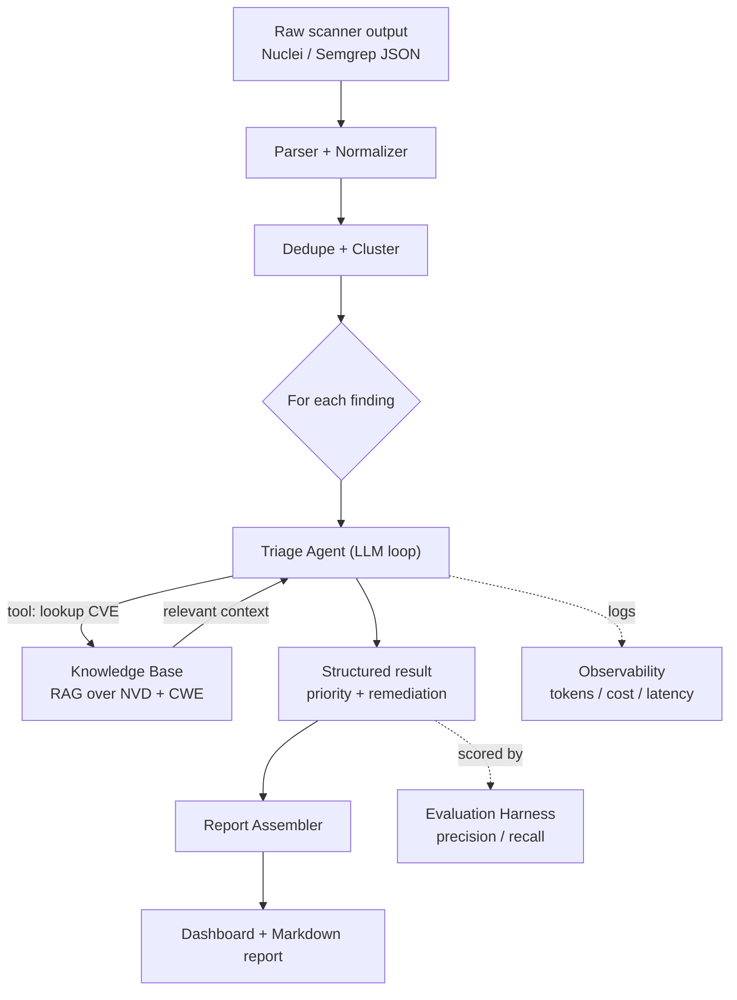
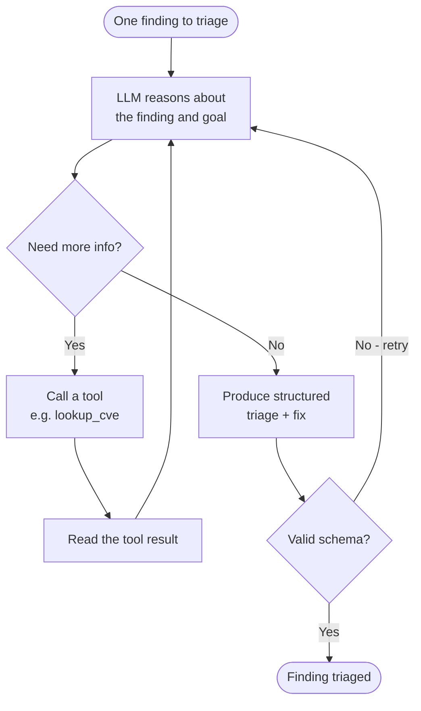
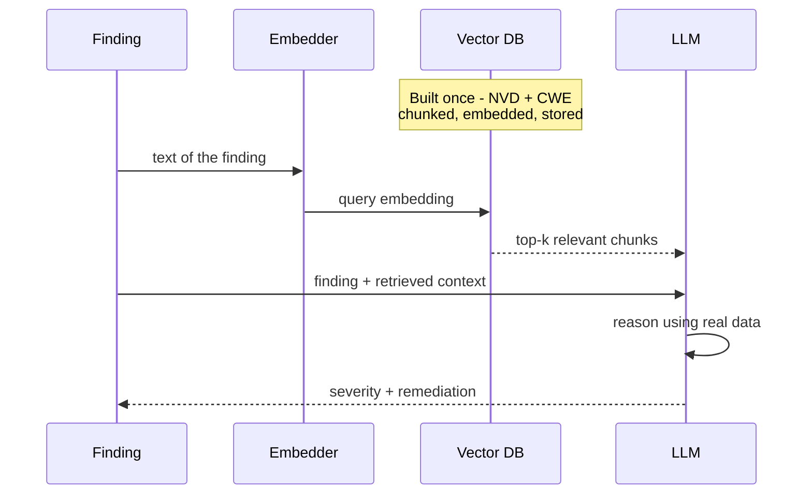

# Learning Guide — Security Scanner Triage Agent

A from-scratch guide to building an LLM agent that triages and remediates security scanner output. Read this top to bottom once, then keep it open while you build with Claude Code.

---

## 1. The big picture

Security scanners (Nuclei, Semgrep, Trivy, ZAP) flood teams with raw "findings": hundreds of issues full of duplicates, false alarms, generic severity labels, and no fix guidance. A human has to sort through all of it — slow, repetitive work.

You are building a system that ingests that raw output and produces a **prioritized, deduplicated, remediated report**. The "brain" is an **LLM agent** that looks up real vulnerability data (via **RAG**) before deciding how serious each finding is and how to fix it.

Three things turn this from a toy into something an AI engineering team respects:
- **Evaluation** — measure how accurate your triage is against a known answer key.
- **Observability** — log tokens, cost, and latency for every model call.
- **Guardrails** — the tool explains how to *fix* issues, never how to *attack*.

---

## 2. Architecture

Read it as a pipeline: raw data in on the left, a clean report out on the right. The agent (E) is the only "smart" box; everything else is plumbing around it. The dotted lines are the cross-cutting concerns that run alongside the pipeline.

---

## 3. The agent loop

A plain LLM call is one-shot. An **agent** wraps the LLM in a loop so it can fetch facts with **tools** and decide its own next step before answering. This loop is the heart of the project.

Key ideas hiding in this diagram:
- The model **decides** whether it needs a tool — you don't hardcode that.
- A **tool** is just a function you let the model call; your code runs it and feeds the result back in.
- The final answer is forced into a **fixed schema** and re-tried if it comes back malformed. This is what makes the output reliable enough to build a product on.

---

## 4. How RAG works

The model's training data doesn't contain the full, current vulnerability database, and you never want it inventing CVE details. RAG retrieves real reference data and puts it in the prompt before the model answers.

Two phases to keep separate in your head:
- **Indexing (once):** download NVD + CWE data, split into chunks, embed each chunk, store the vectors in Chroma.
- **Querying (every finding):** embed the finding, pull the nearest chunks, hand them to the model as grounding.

---

## 5. Build roadmap

Build these **in order, one at a time**. Each phase teaches one new idea — don't jump ahead.

1. **Setup & a sample input.** Repo skeleton, virtual env, dependencies, and one real scanner JSON in `data/`. *Learn: the shape of scanner output.*
2. **Ingest + normalize.** Parse scanner JSON into a clean `Finding` data model with tests. *Learn: structured data with Pydantic.*
3. **The LLM client.** A provider-agnostic wrapper with one `complete()` method plus token/cost logging. *Learn: how you actually call an LLM, and why you log usage.*
4. **First triage, no agent yet.** A single LLM call that takes one finding and returns a structured priority + reasoning. *Learn: structured outputs and prompt design.*
5. **The agent loop.** Wrap the LLM in a reason → act → observe loop, with a stub tool first, then a real one. *Learn: how agents work mechanically. Go slow here — this is the core.*
6. **RAG knowledge base.** Download NVD + CWE, chunk, embed, store in Chroma, then build the `lookup_cve` tool the agent calls. *Learn: embeddings, vector search, retrieval.*
7. **Dedupe + clustering.** Collapse duplicate findings before triage. *Learn: similarity and clustering.*
8. **Report + dashboard.** Assemble results and build a Streamlit dashboard. *Learn: turning model output into a product surface.*
9. **Evaluation harness.** Build a small labeled set (e.g., from OWASP Juice Shop) and measure precision/recall of your prioritization and false-positive filtering. *Learn: how to prove an LLM system actually works.*
10. **Polish.** Observability view, Docker, README with the architecture diagram and a demo clip. *Learn: shipping.*

A weekend gets you through roughly phases 1–4 (a working single-finding triager). The rest is where the project gets impressive.

---

## 6. Working with Claude Code

Each session follows the same rhythm (the CLAUDE.md enforces this):
1. Claude states which phase you're on.
2. It explains the concept in plain language **before** writing code.
3. It implements one small piece.
4. It explains what the code does and how to run it.
5. It checkpoints — you confirm before moving on.

Your starter prompt for the very first session:

> Read CLAUDE.md and LEARNING_GUIDE.md. We're starting Phase 1. Explain the concept first, then set up the repo. Go slowly and check with me before each step — I want to understand everything, not just get working code.

When Claude pauses, ask **"why?"** as much as you want. The whole point is to learn, and the CLAUDE.md tells it to give real answers.

---

## 7. Glossary

- **CVE** — Common Vulnerabilities and Exposures: a unique ID for a specific known vulnerability (e.g., CVE-2021-44228).
- **CWE** — Common Weakness Enumeration: a category of weakness type (e.g., CWE-79 = cross-site scripting).
- **CVSS** — Common Vulnerability Scoring System: a 0–10 severity score for a vulnerability.
- **NVD** — National Vulnerability Database: a public, downloadable database of CVEs.
- **Nuclei** — a template-based scanner that probes running web targets.
- **Semgrep** — a static analysis tool that scans source code for insecure patterns.
- **Trivy** — a scanner for dependencies and container images.
- **OWASP Juice Shop** — an intentionally vulnerable web app, used as a safe practice target and answer key.
- **Embedding** — a list of numbers representing the meaning of a piece of text, so similar text sits "close" in vector space.
- **Vector database (Chroma)** — stores embeddings and finds the nearest ones to a query.
- **RAG** — Retrieval-Augmented Generation: retrieve relevant reference text and add it to the prompt before the model answers.
- **Agent** — an LLM in a loop that can call tools and decide its next step.
- **Tool** — a function the model is allowed to call; your code runs it and returns the result.
- **Structured output** — forcing the model's answer into a fixed schema (via Pydantic) so it's reliable to build on.
