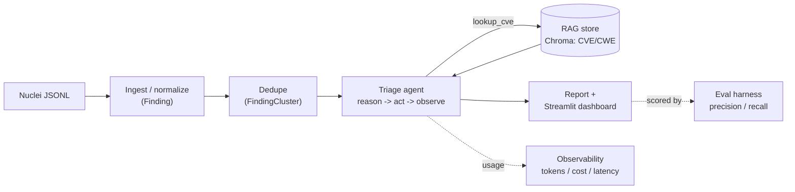

# Security Scanner Triage Agent

An LLM agent that ingests raw security-scanner output (Nuclei / Semgrep JSON),
then **deduplicates, prioritizes, and remediates** the findings — producing a
clean report and dashboard.

> **Safety stance:** this tool explains *how to fix* issues. It never generates
> exploits, payloads, or attack code, and only operates on scanner output you
> provide or on intentionally vulnerable practice targets in a lab you control.

This repo is built **in small phases as a learning project** — see
[`LEARNING_GUIDE.md`](LEARNING_GUIDE.md) for the architecture and concepts, and
[`CLAUDE.md`](CLAUDE.md) for how the build is structured.

## Architecture



## Prerequisites

- Python 3.11+ (developed on 3.13)
- git

## Setup

```powershell
# 1. Create the virtual environment (needs Python 3.11+)
py -m venv .venv

# 2. Activate it (PowerShell)
.\.venv\Scripts\Activate.ps1

# 3. Install dependencies
pip install -r requirements.txt

# 4. Configure the LLM provider: copy the template, then add your API key
Copy-Item .env.example .env   # then edit .env and set GROQ_API_KEY
```

## Usage

```powershell
# Build the RAG knowledge base (once)
python -m app.rag.knowledge_base

# Launch the dashboard (opens in your browser)
streamlit run dashboard/app.py
```

## Evaluation

A small labeled answer key ([`eval/labels.jsonl`](eval/labels.jsonl)) lets us measure
triage quality instead of eyeballing it. Run `python -m eval.evaluate`. On the bundled
sample (5 clusters), a representative run:

| Metric | Score |
|---|---|
| Priority exact-match accuracy | 60% (3/5) |
| Priority within one level | 100% |
| False-positive precision | n/a (no FP predicted this run) |
| False-positive recall | 0% (1 labeled FP, missed this run) |

These numbers are **illustrative**: the labeled set is tiny and the model runs at a
non-zero temperature, so results vary run to run. The harness is the point — it turns
"seems right" into a number and surfaces genuine judgment gaps (e.g. whether version
disclosure counts as a false positive).

## Build log

A short note per phase, describing what it added.

- **Phase 1 — Setup & sample input.** Repo skeleton (`.gitignore`, `.env.example`,
  `requirements.txt`, `README.md`) and a Python virtual environment. Added a
  realistic 6-finding Nuclei sample at
  [`data/nuclei_sample.jsonl`](data/nuclei_sample.jsonl) — note the **JSONL**
  format (one finding per line). Documented the finding schema and the
  JSON-vs-JSONL distinction.
- **Phase 2 — Ingest + normalize.** Added the `pydantic` + `pytest` dependencies
  and the normalized, scanner-agnostic [`Finding`](app/schemas/finding.py) model
  (typed, validated, with a `Severity` enum). Wrote the Nuclei parser
  ([`app/ingest/nuclei.py`](app/ingest/nuclei.py)) mapping raw JSONL records onto
  `Finding`, covered by a 6-test suite ([`tests/test_ingest.py`](tests/test_ingest.py)).
  Run the tests with `pytest`.
- **Phase 3 — LLM client.** Added a provider-agnostic LLM client
  ([`app/llm/`](app/llm/)) with a single `complete()` method, a typed `LLMResult`,
  per-call token/latency/cost logging, and a pricing table. The active provider is
  **Groq** (free tier, default model `llama-3.3-70b-versatile`), configured via
  `.env` (`python-dotenv`); Anthropic is a documented drop-in. Verified with one
  real API call.
- **Phase 4 — First triage (no agent yet).** Added a structured-output helper
  (`complete_structured()` — JSON mode + Pydantic validation + retry) and a
  `TriageResult` schema ([`app/schemas/triage.py`](app/schemas/triage.py)). The
  single-shot triage step ([`app/agent/triage.py`](app/agent/triage.py)) turns a
  `Finding` into a recommended priority, false-positive flag, confidence, reasoning,
  and remediation — one LLM call, no loop. On the sample it re-prioritized an
  exposed `.env` from high→critical and flagged version disclosure as a false
  positive. Faked-LLM tests in [`tests/test_triage.py`](tests/test_triage.py).
- **Phase 5 — The agent loop.** Hand-wrote a reason→act→observe agent
  ([`app/agent/loop.py`](app/agent/loop.py)) that offers the model tools
  ([`app/agent/tools.py`](app/agent/tools.py)), runs the ones it requests, feeds the
  results back, and loops (with an iteration cap) until it produces a validated
  `TriageResult`. Added a tool-enabled `chat()` to the LLM client. A stub `lookup_cve`
  already shows the value — the agent corrects the model's memory (Log4j fixed in
  2.17.1, not 2.15.1). Mocked loop test in [`tests/test_agent.py`](tests/test_agent.py).
- **Phase 6 — RAG knowledge base.** Built a local Chroma vector store
  ([`app/rag/knowledge_base.py`](app/rag/knowledge_base.py)) over a curated CVE/CWE
  corpus ([`data/kb/knowledge_base.jsonl`](data/kb/knowledge_base.jsonl)), embedded
  with Chroma's offline `all-MiniLM-L6-v2`. Replaced the stub `lookup_cve` with real
  semantic retrieval — and the agent loop didn't change. Search matches by meaning
  (e.g. finds Heartbleed from "leaking memory and private keys"). The store
  (`chroma_db/`) is gitignored; build it with `python -m app.rag.knowledge_base`.
- **Phase 7 — Dedupe + clustering.** Added `dedupe_findings`
  ([`app/dedupe/dedupe.py`](app/dedupe/dedupe.py)) and a `FindingCluster` model
  ([`app/schemas/cluster.py`](app/schemas/cluster.py)) that collapse findings sharing
  a `rule_id` into one cluster (key is configurable), so triage runs once per cluster
  instead of once per finding. On the sample: 6 findings → 5 clusters (the
  missing-headers pair merged). Tests in [`tests/test_dedupe.py`](tests/test_dedupe.py).
- **Phase 8 — Report + dashboard.** Added the report assembler
  ([`app/report/report.py`](app/report/report.py)): `build_report` runs the full
  pipeline (ingest → dedupe → triage each cluster → sort) into a `Report`, with a
  Markdown renderer. Plus a Streamlit dashboard ([`dashboard/app.py`](dashboard/app.py))
  — `streamlit run dashboard/app.py`. Report assembly tested offline; suite at 13.
- **Phase 9 — Evaluation harness.** Added a labeled answer key
  ([`eval/labels.jsonl`](eval/labels.jsonl)) and a metrics harness
  ([`eval/evaluate.py`](eval/evaluate.py)) measuring priority accuracy and
  false-positive precision/recall against it (run `python -m eval.evaluate`; see
  **Evaluation** above). The metric math is unit-tested; suite at 16.
- **Phase 10 — Polish.** Added an observability accumulator (`UsageStats` on the LLM
  client) totalling tokens/cost/latency across a run, surfaced in the dashboard; an
  architecture diagram (above); and Docker packaging (`Dockerfile` + `.dockerignore`).
  Build/run: `docker build -t triage-agent .` then
  `docker run --rm -e GROQ_API_KEY=... -p 8501:8501 triage-agent`. Suite at 17.
