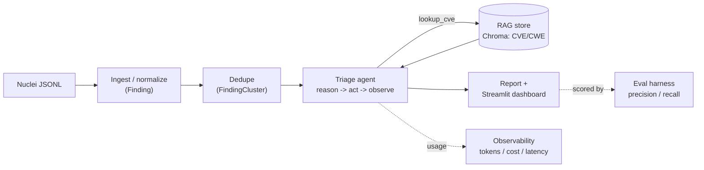
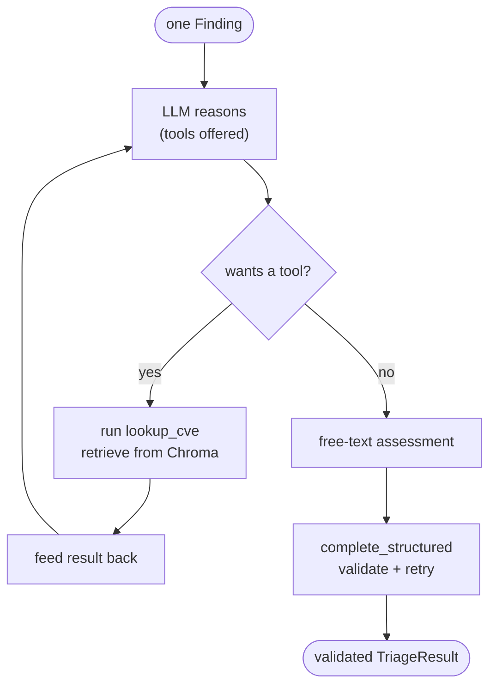
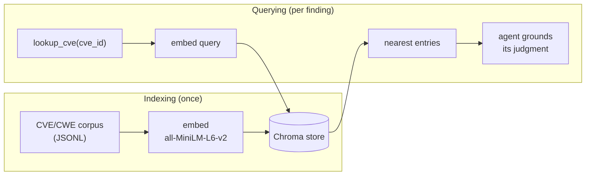

# Security Scanner Triage Agent

An LLM agent that ingests raw security-scanner output (Nuclei / Semgrep JSON),
then **deduplicates, prioritizes, and remediates** the findings — producing a
clean report and dashboard.

> **Safety stance:** this tool explains *how to fix* issues. It never generates
> exploits, payloads, or attack code, and only operates on scanner output you
> provide or on intentionally vulnerable practice targets in a lab you control.

This repo is built **in small phases as a learning project** — see
[`LEARNING_GUIDE.md`](LEARNING_GUIDE.md) for the architecture and concepts, and
[`CLAUDE.md`](CLAUDE.md) for how the build is structured.

## What makes this different

Most scanner output is a flat, noisy list with generic severity labels and no fix
guidance. This project turns that into a **prioritized, deduplicated, remediated**
report — and a few things set it apart:

- **It re-prioritizes, not just relabels.** The agent assigns its *own* action
  priority and can disagree with the scanner — e.g. it escalates an exposed `.env`
  from the scanner's `high` to `critical`, with a stated reason.
- **It's grounded in real data (RAG), not the model's memory.** Before judging a CVE
  it retrieves authoritative CVE/CWE reference text from a local vector store — so it
  gives the *correct* Log4Shell fix (`2.17.1`), where the model alone said `2.15.1`.
- **It filters false positives** and **deduplicates** near-identical findings, so you
  triage each real issue once instead of many times.
- **It's measured, not vibes.** An evaluation harness scores priority accuracy and
  false-positive precision/recall against a labeled answer key.
- **It's observable and cost-aware.** Every model call logs tokens, latency, and
  estimated cost; per-run totals show up in the dashboard.
- **It's provider-agnostic and free to run.** Groq's free tier plus a local, offline
  embedding model — no paid API required — with Anthropic Claude a one-line swap away.
- **The agent loop is hand-written** (no LangChain/LangGraph), so the
  reason → act → observe mechanics are fully visible.
- **Safety-first by design:** it explains *how to fix*, never how to attack.

## Architecture



### How it works (pipeline walkthrough)

1. **Ingest & normalize** — `parse_nuclei_file` reads the Nuclei **JSONL** (one finding
   per line) and maps each record onto a validated, scanner-agnostic `Finding`
   (Pydantic). Quirks like kebab-case keys and a missing `classification` block are
   handled here, not downstream.
2. **Dedupe** — `dedupe_findings` groups findings that share a `rule_id` into a
   `FindingCluster`, so the same issue at many URLs is triaged once (key is configurable).
3. **Triage (the agent)** — for each cluster, `run_triage_agent` runs a
   reason → act → observe loop: the model may call the `lookup_cve` tool, which
   retrieves real CVE/CWE context from the Chroma store; when it has enough, the
   free-text assessment is converted to a validated `TriageResult` (priority,
   false-positive flag, confidence, reasoning, remediation) via `complete_structured`.
4. **Assemble** — `build_report` sorts the triaged clusters by priority and computes a
   summary into a `Report` (rendered to Markdown or shown in the dashboard).
5. **Cross-cutting** — every LLM call logs and accumulates token/cost/latency
   (`UsageStats`); the eval harness scores the output against labels.

### The agent loop



### How RAG works



## Tech stack

| Area | Choice | Why this one |
|---|---|---|
| Language | **Python 3.11+** (developed on 3.13) | ubiquitous for LLM/ML tooling |
| Data models | **Pydantic v2** | typed, self-validating models at every module boundary |
| LLM access | **Groq** SDK (default `llama-3.3-70b-versatile`) | free tier, OpenAI-style API; wrapped provider-agnostically (Anthropic is a drop-in) |
| Config & secrets | **python-dotenv** + gitignored `.env` | secrets in the environment, never in code |
| RAG store | **Chroma** (`chromadb`) | simple local vector DB that persists to disk |
| Embeddings | **all-MiniLM-L6-v2** (Chroma's built-in ONNX model) | runs locally/offline — no API key, no cost |
| Agent | **hand-written loop** (no framework) | keeps the reason → act → observe mechanics visible |
| Dashboard | **Streamlit** | minimal code to a clickable web UI |
| Tests | **pytest** | 17 tests, all offline (LLM + Chroma faked) |
| Packaging | **Docker** | one image runs the dashboard |

## Project structure

```
app/
  ingest/     # parse + normalize scanner JSON -> Finding
    nuclei.py
  schemas/    # Pydantic data models (the contracts between modules)
    finding.py  triage.py  cluster.py  report.py
  llm/        # provider-agnostic client: complete(), complete_structured(), chat()
    config.py  client.py  pricing.py        # + per-call cost/usage logging
  agent/      # single-shot triage, the reason->act->observe loop, and the tools
    triage.py  loop.py  tools.py
  rag/        # build + query the Chroma knowledge base
    knowledge_base.py
  dedupe/     # collapse duplicate findings into clusters
    dedupe.py
  report/     # assemble + render the prioritized report
    report.py
dashboard/    # Streamlit UI
  app.py
eval/         # labeled answer key + precision/recall metrics
  labels.jsonl  evaluate.py
data/
  nuclei_sample.jsonl        # sample scanner input
  kb/knowledge_base.jsonl    # curated CVE/CWE corpus (the RAG source)
tests/        # 17 offline unit tests (LLM + Chroma faked)
Dockerfile   requirements.txt   pyproject.toml   .env.example
```

## Design decisions (how it's implemented)

- **Provider-agnostic LLM client.** The app calls one `complete()` / `chat()`; the
  provider and model live in `.env`, dispatched on `config.provider`. Swapping
  Groq → Anthropic is a config change, and the model name is never hardcoded.
- **Reliable structured output.** `complete_structured()` asks for JSON matching a
  Pydantic schema, validates it, and **re-prompts with the error and retries** on
  failure — turning flaky text into a trustworthy typed object.
- **A clean tool seam.** A tool is just a Python function plus a JSON schema; the model
  *requests* it, our code runs it. `lookup_cve` went from a hard-coded stub to real RAG
  retrieval **without changing a line of the agent loop**.
- **Normalize at the edge.** All scanner-specific quirks live in the parser; everything
  downstream sees the same `Finding`. Adding Semgrep means adding a parser, not touching
  triage or reporting.
- **Dedupe before triage** so the LLM never judges the same issue twice.
- **One observability chokepoint.** Every call funnels through `_make_result`, which
  logs and accumulates `UsageStats` — so tokens/cost/latency are captured everywhere.
- **Testable without the network.** The LLM and vector store are faked in tests (17
  fast, offline tests); the live paths are exercised by the runnable demos.
- **Safety as a constraint.** The triage prompt and tools only ever produce
  *remediation* ("how to fix"), never exploit or attack content.

## Prerequisites

- Python 3.11+ (developed on 3.13)
- git

## Setup

```powershell
# 1. Create the virtual environment (needs Python 3.11+)
py -m venv .venv

# 2. Activate it (PowerShell)
.\.venv\Scripts\Activate.ps1

# 3. Install dependencies
pip install -r requirements.txt

# 4. Configure the LLM provider: copy the template, then add your API key
Copy-Item .env.example .env   # then edit .env and set GROQ_API_KEY
```

## Usage

After **Setup**, run everything from the project root with the venv activated
(`.\.venv\Scripts\Activate.ps1`).

```powershell
# Build the RAG knowledge base (once; rebuild after editing data/kb/knowledge_base.jsonl)
python -m app.rag.knowledge_base

# Launch the dashboard, then open http://localhost:8501 and click "Run triage"
streamlit run dashboard/app.py

# Run the evaluation harness (prints accuracy / precision / recall)
python -m eval.evaluate

# Run the tests (fast, fully offline -- no API calls)
pytest
```

Generate a Markdown report (`triage_report.md`) from the command line instead of the dashboard:

```powershell
python -c "import sys; sys.stdout.reconfigure(encoding='utf-8'); from pathlib import Path; from app.ingest import parse_nuclei_file; from app.llm import LLMClient, LLMConfig; from app.report import build_report, render_markdown; r = build_report(parse_nuclei_file('data/nuclei_sample.jsonl'), LLMClient(LLMConfig.from_env())); Path('triage_report.md').write_text(render_markdown(r), encoding='utf-8'); print('wrote triage_report.md')"
```

### Docker (optional)

```powershell
docker build -t triage-agent .
docker run --rm -e GROQ_API_KEY=your-gsk-key -p 8501:8501 triage-agent   # open http://localhost:8501
```

## Evaluation

A small labeled answer key ([`eval/labels.jsonl`](eval/labels.jsonl)) lets us measure
triage quality instead of eyeballing it. Run `python -m eval.evaluate`. On the bundled
sample (5 clusters), a representative run:

| Metric | Score |
|---|---|
| Priority exact-match accuracy | 60% (3/5) |
| Priority within one level | 100% |
| False-positive precision | n/a (no FP predicted this run) |
| False-positive recall | 0% (1 labeled FP, missed this run) |

These numbers are **illustrative**: the labeled set is tiny and the model runs at a
non-zero temperature, so results vary run to run. The harness is the point — it turns
"seems right" into a number and surfaces genuine judgment gaps (e.g. whether version
disclosure counts as a false positive).

## Troubleshooting

| Symptom | Fix |
|---|---|
| `RuntimeError: Missing API key: set GROQ_API_KEY` | `.env` is missing or still has the placeholder — set your real key and re-run. |
| `Activate.ps1 cannot be loaded` | `Set-ExecutionPolicy -Scope CurrentUser RemoteSigned`, then activate again. |
| `ModuleNotFoundError: app` | Run from the project root with the venv activated. |
| Dashboard shows no results | Click **Run triage** — it doesn't auto-run (it makes live calls). |
| Rate-limited by Groq | Free-tier limit; wait a minute or set `LLM_MODEL=llama-3.1-8b-instant` in `.env`. |

## Build log

A short note per phase, describing what it added.

- **Phase 1 — Setup & sample input.** Repo skeleton (`.gitignore`, `.env.example`,
  `requirements.txt`, `README.md`) and a Python virtual environment. Added a
  realistic 6-finding Nuclei sample at
  [`data/nuclei_sample.jsonl`](data/nuclei_sample.jsonl) — note the **JSONL**
  format (one finding per line). Documented the finding schema and the
  JSON-vs-JSONL distinction.
- **Phase 2 — Ingest + normalize.** Added the `pydantic` + `pytest` dependencies
  and the normalized, scanner-agnostic [`Finding`](app/schemas/finding.py) model
  (typed, validated, with a `Severity` enum). Wrote the Nuclei parser
  ([`app/ingest/nuclei.py`](app/ingest/nuclei.py)) mapping raw JSONL records onto
  `Finding`, covered by a 6-test suite ([`tests/test_ingest.py`](tests/test_ingest.py)).
  Run the tests with `pytest`.
- **Phase 3 — LLM client.** Added a provider-agnostic LLM client
  ([`app/llm/`](app/llm/)) with a single `complete()` method, a typed `LLMResult`,
  per-call token/latency/cost logging, and a pricing table. The active provider is
  **Groq** (free tier, default model `llama-3.3-70b-versatile`), configured via
  `.env` (`python-dotenv`); Anthropic is a documented drop-in. Verified with one
  real API call.
- **Phase 4 — First triage (no agent yet).** Added a structured-output helper
  (`complete_structured()` — JSON mode + Pydantic validation + retry) and a
  `TriageResult` schema ([`app/schemas/triage.py`](app/schemas/triage.py)). The
  single-shot triage step ([`app/agent/triage.py`](app/agent/triage.py)) turns a
  `Finding` into a recommended priority, false-positive flag, confidence, reasoning,
  and remediation — one LLM call, no loop. On the sample it re-prioritized an
  exposed `.env` from high→critical and flagged version disclosure as a false
  positive. Faked-LLM tests in [`tests/test_triage.py`](tests/test_triage.py).
- **Phase 5 — The agent loop.** Hand-wrote a reason→act→observe agent
  ([`app/agent/loop.py`](app/agent/loop.py)) that offers the model tools
  ([`app/agent/tools.py`](app/agent/tools.py)), runs the ones it requests, feeds the
  results back, and loops (with an iteration cap) until it produces a validated
  `TriageResult`. Added a tool-enabled `chat()` to the LLM client. A stub `lookup_cve`
  already shows the value — the agent corrects the model's memory (Log4j fixed in
  2.17.1, not 2.15.1). Mocked loop test in [`tests/test_agent.py`](tests/test_agent.py).
- **Phase 6 — RAG knowledge base.** Built a local Chroma vector store
  ([`app/rag/knowledge_base.py`](app/rag/knowledge_base.py)) over a curated CVE/CWE
  corpus ([`data/kb/knowledge_base.jsonl`](data/kb/knowledge_base.jsonl)), embedded
  with Chroma's offline `all-MiniLM-L6-v2`. Replaced the stub `lookup_cve` with real
  semantic retrieval — and the agent loop didn't change. Search matches by meaning
  (e.g. finds Heartbleed from "leaking memory and private keys"). The store
  (`chroma_db/`) is gitignored; build it with `python -m app.rag.knowledge_base`.
- **Phase 7 — Dedupe + clustering.** Added `dedupe_findings`
  ([`app/dedupe/dedupe.py`](app/dedupe/dedupe.py)) and a `FindingCluster` model
  ([`app/schemas/cluster.py`](app/schemas/cluster.py)) that collapse findings sharing
  a `rule_id` into one cluster (key is configurable), so triage runs once per cluster
  instead of once per finding. On the sample: 6 findings → 5 clusters (the
  missing-headers pair merged). Tests in [`tests/test_dedupe.py`](tests/test_dedupe.py).
- **Phase 8 — Report + dashboard.** Added the report assembler
  ([`app/report/report.py`](app/report/report.py)): `build_report` runs the full
  pipeline (ingest → dedupe → triage each cluster → sort) into a `Report`, with a
  Markdown renderer. Plus a Streamlit dashboard ([`dashboard/app.py`](dashboard/app.py))
  — `streamlit run dashboard/app.py`. Report assembly tested offline; suite at 13.
- **Phase 9 — Evaluation harness.** Added a labeled answer key
  ([`eval/labels.jsonl`](eval/labels.jsonl)) and a metrics harness
  ([`eval/evaluate.py`](eval/evaluate.py)) measuring priority accuracy and
  false-positive precision/recall against it (run `python -m eval.evaluate`; see
  **Evaluation** above). The metric math is unit-tested; suite at 16.
- **Phase 10 — Polish.** Added an observability accumulator (`UsageStats` on the LLM
  client) totalling tokens/cost/latency across a run, surfaced in the dashboard; an
  architecture diagram (above); and Docker packaging (`Dockerfile` + `.dockerignore`).
  Build/run: `docker build -t triage-agent .` then
  `docker run --rm -e GROQ_API_KEY=... -p 8501:8501 triage-agent`. Suite at 17.
